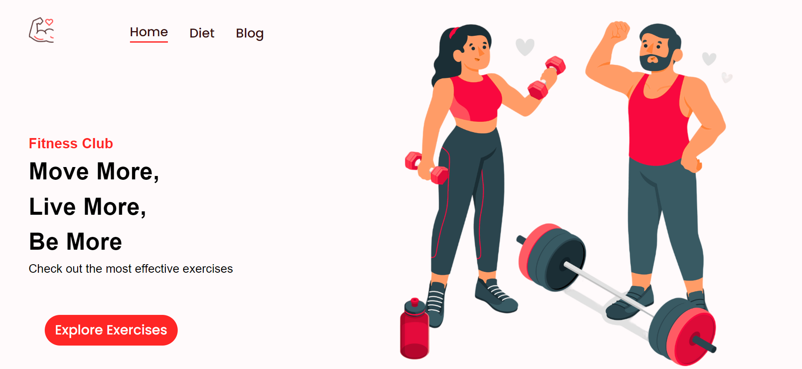
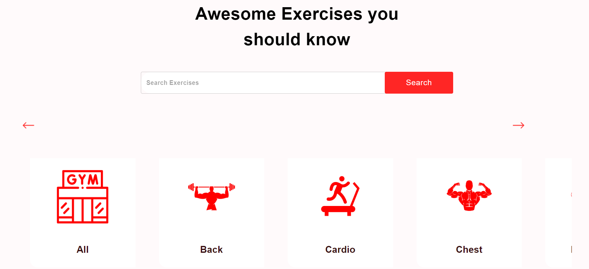
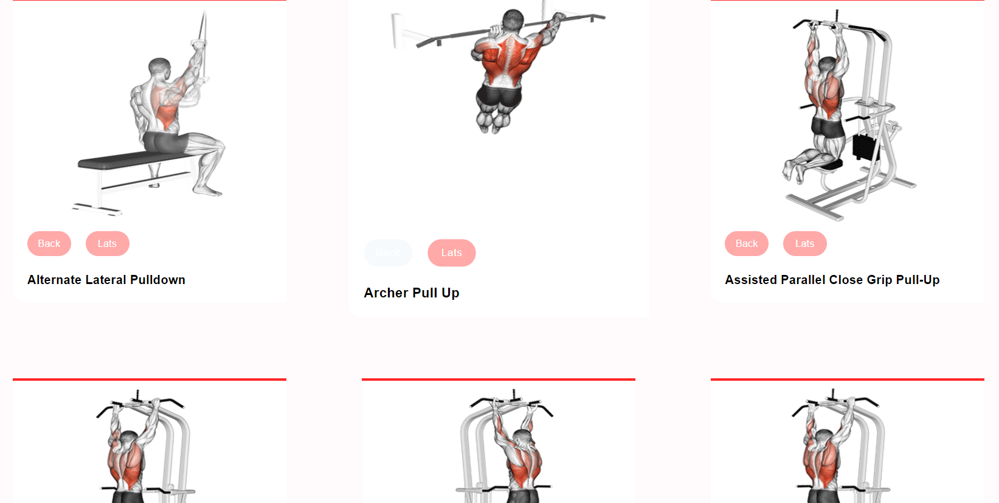
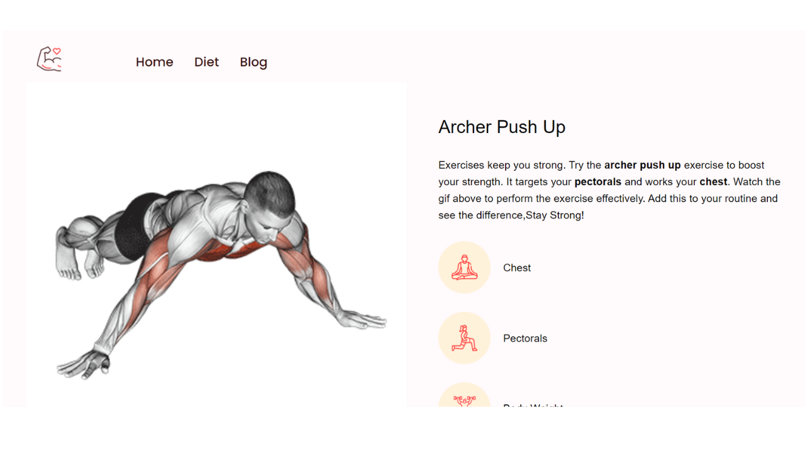
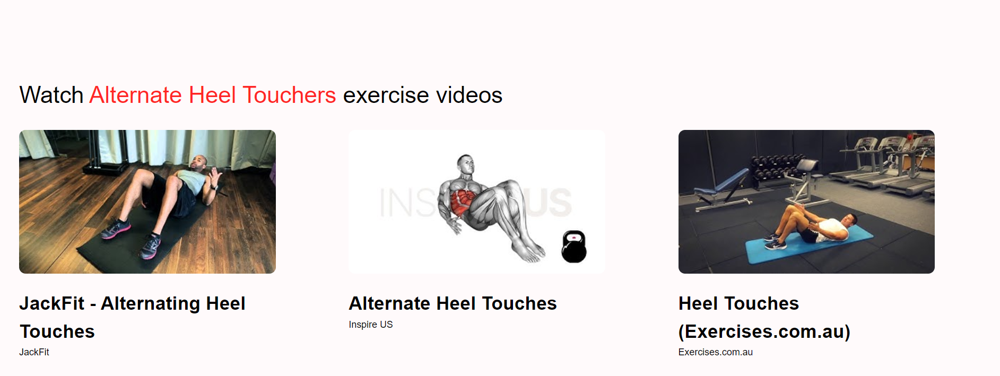
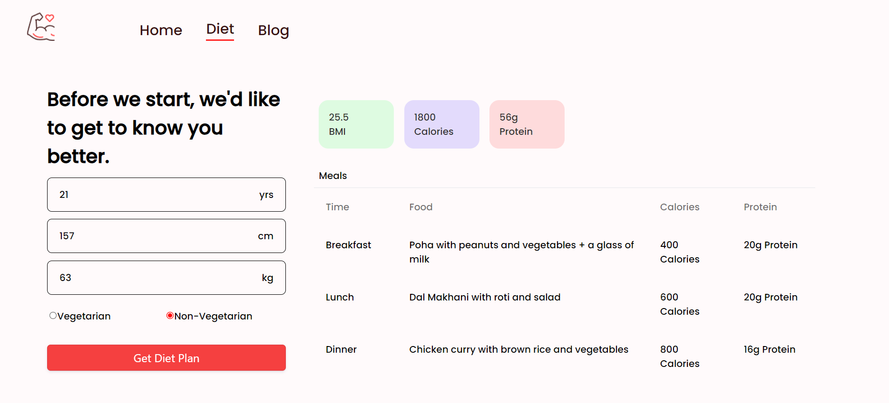
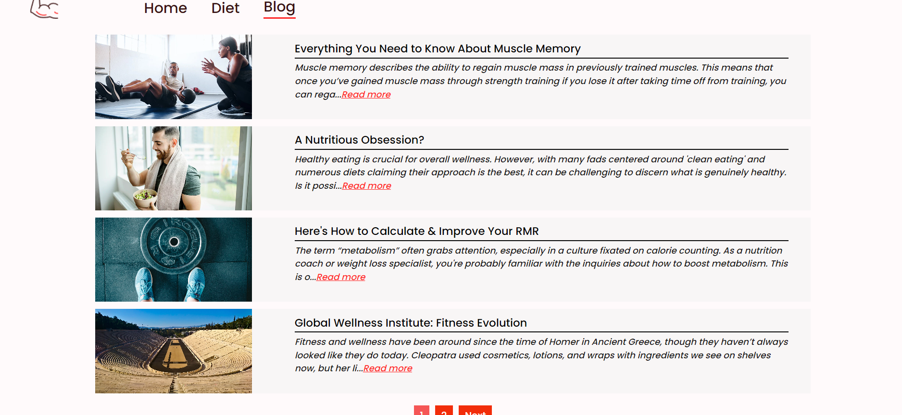

# Fitness_Guide-Website

The **Fitness Guide Website** is a comprehensive web application that allows users to explore various exercises, tailored to their specific needs, and helps to enhance their fitness routine.

## Key Features:
- **Search & Filter**: Sort exercises by muscle group, equipment, and exercise type.
- **Embedded YouTube Videos**: Demonstrate proper exercise techniques.
- **Diet Section**: Powered by Gemini API, offering dietary recommendations and meal plans.
- **Exercise GIFs**: Integrated via RapidAPI, providing quick visual references for each exercise.

## Screenshots:
- **Home Page**:
  

- **Filtering**:
  

- **Exercise Page**:
  

- **Detailed Exercise Page**:
  

- **YouTube Video Recommendation**:
  

- **Diet Section**:
  

- **Blog Section**:
  

## Technologies Used:
- **ReactJS**: Main framework for a structured, component-based UI.
- **Material-UI**: For responsive and visually appealing interface components.
- **RapidAPI**: For fetching exercise GIFs to enhance visual guidance.
- **Gemini API**: Powers the diet section, providing tailored meal plans and dietary recommendations.
- **Context Api**: Used Context Api for State Management to Avoid prop Drilling.

## How to Run:
1. Clone this repository.
2. Run `npm install` to install dependencies.
3. Run `npm run dev` to start the development server.

